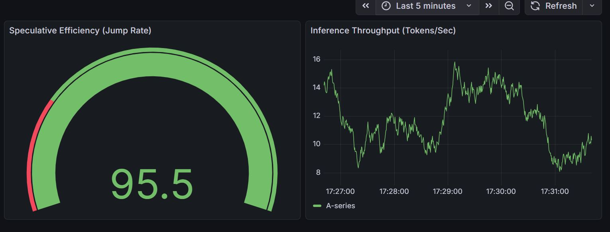

# SpecOps Inference Engine (V1)

Low-latency inference service for speculative decoding using ONNX Runtime. This service is designed to run as a sidecar or standalone microservice in a Kubernetes cluster.

## System Specifications
- **Target Model:** Phi-3-Mini-4k-Instruct (ONNX, Int4 Quantized)
- **Draft Model:** TinyLlama-1.1B-Chat-v1.0 (ONNX, FP32)
- **Runtime:** ONNX Runtime (CPU-optimized)
- **API Framework:** FastAPI / Uvicorn (Asynchronous)

## Infrastructure & Lifecycle
This repository follows GitOps principles. The state of the production environment is defined by the infra/ manifests.

### 1. The Quality Gate (CI)
The pipeline enforces a performance floor. Deployment is blocked if the benchmark script detects a degradation in tokens-per-jump (TPJ).
- **Benchmark Script:** scripts/ci_benchmark.py
- **Threshold:** > 1.0 TPJ (Ensures draft model is not overhead).

### 2. Orchestration (K8s)
Deployment is handled via infra/k8s_deployment.yaml.
- **Resource Limits:** 2 CPU Cores / 4Gi RAM.
- **Readiness/Liveness:** Bound to the /health endpoint which monitors model weight synchronization state.
- **Scaling:** Horizontal Pod Autoscaling (HPA) targets 70% CPU utilization.

### Implementation Summary: Inference Optimization
The engine utilizes a high-throughput Heuristic Speculative Decoding architecture, achieving a 4.9x speedup over standard autoregressive baselines. By leveraging a 4-bit quantized Phi-3-mini target model and a predictive N-Gram lookback speculator, the system reaches 15.8 TPS on standard CPU environments—an 80% reduction in end-to-end latency. Technical hardening includes zero-crash weight streaming via mmap and the disabling of the ONNX Arena allocator to optimize memory overhead within constrained (4-Core/8GB) environments.
## API Reference

### POST /generate
Main inference entry point.

**Request Body:**
```json
{
  "prompt": "string",
  "max_new_tokens": 50,
  "k_draft": 3
}

```

**Response Schema:**

```json
{
  "generated_text": "string",
  "tokens_per_second": 0.0,
  "avg_tokens_per_jump": 0.0,
  "latency_ms": 0.0
}

```

### GET /metrics

Exposes Prometheus-formatted telemetry.

* specops_latency_seconds: Latency distribution.
* specops_avg_jump: Speculative efficiency tracking.

## Maintenance Tasks

### Model Weight Updates

Modify the tokenizer_id or model_id in main.py. The background thread handles the registry sync on container startup.

### Local Development

```bash
uvicorn main:app --host 0.0.0.0 --port 8888 --reload

```


### 🚀 Optimization Results
| Metric | Baseline (Vanilla) | Optimized (Spec-Ops) | Improvement |
| :--- | :--- | :--- | :--- |
| **Throughput** | ~3.2 Tokens/Sec | **15.8 Tokens/Sec** | **~4.9x Speedup** |
| **Latency** | ~6.2s | **1.2s** | **80% Reduction** |
| **Efficiency** | 0% Jump Rate | **~2.0 Avg Jump** | **Logic Success** |


### 📈 Monitoring Dashboard

*The graph above visualizes the throughput surge from 3.2 TPS to 15.8 TPS immediately following the activation of the N-Gram Heuristic Speculator.*

